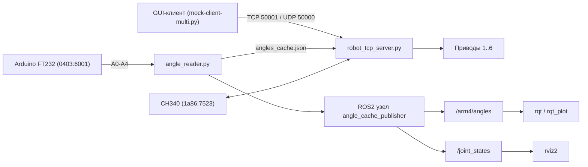

# Robot ARM4 — финальный проект


## Цели финальной работы

Выполнение проекта позволяет:
- закрепить навыки работы с bash-скриптами и Linux;
- закрепить навыки работы с Git-репозиторием и структурой ROS Workspace;
- закрепить навыки работы с Docker (сборка/запуск образа);
- продемонстрировать применение ROS 2 для ПО робота.

## Что нужно сделать (и как это реализовано в проекте)

Проект описывает систему управления роботом-манипулятором `ARM4`:
- архитектура и функции системы описаны в этом `README.md`;
- поддержка датчиков реализована через `angle_reader.py` (каналы `A0-A4`);
- подготовлены инструкции установки, настройки и запуска;
- реализован ROS 2 слой публикации и визуализации данных.

## Требования и реализация

### 1) Концепция робота

`Robot ARM4` — робот-манипулятор с 6 осями:
- удаленное управление по TCP/UDP;
- управление приводами через serial-интерфейсы;
- обратная связь по углам через Arduino;
- публикация состояния в ROS 2.

Основные скрипты:
- `angle_reader.py` — читает `A0-A4`, пишет `angles_cache.json`;
- `robot_tcp_server.py` — сетевой сервер управления моторами;
- `mock-client-multi.py` — GUI-клиент.

### 2) Схема подключения датчиков и исполнительных устройств



Интерфейсы:
- Arduino FT232 (`0403:6001`) — датчики угла `A0-A4`;
- CH340 (`1a86:7523`) — управление MKS-приводами;
- TCP/UDP — обмен с клиентом управления.

### 3) Библиотеки и пакеты ROS + install-скрипт

Скрипт: `scripts/install_dependencies.sh`
- устанавливает Python-зависимости (`pyserial`, `customtkinter` и др.);
- устанавливает ROS-пакеты;
- поддерживает уже установленный ROS (`Jazzy`) и Linux-окружение.

Запуск:
```bash
cd ~/Robot\ ARM4
chmod +x scripts/install_dependencies.sh
./scripts/install_dependencies.sh
```

### 4) SSH-скрипт

Скрипт: `scripts/setup_ssh.sh`
- устанавливает `openssh-server`;
- включает сервис;
- применяет базовую настройку SSH.

Запуск:
```bash
cd ~/Robot\ ARM4
chmod +x scripts/setup_ssh.sh
sudo ./scripts/setup_ssh.sh
```

### 5) Репозиторий с ROS Workspace и инструкциями

В репозитории присутствуют:
- `ros_ws/` (workspace),
- `ros_ws/src/arm4_bringup` (ROS 2 пакет),
- этот `README.md` с инструкциями установки/запуска и структурной схемой.

### 6) ROS launch с параметрами rviz/rqt

Launch-файл:
- `ros_ws/src/arm4_bringup/launch/arm4_bringup.launch.py`
- поддерживает: `rviz:=true`, `rqt:=true`.

Сборка и запуск:
```bash
cd ~/Robot\ ARM4/ros_ws
colcon build
source install/setup.bash
ros2 launch arm4_bringup arm4_bringup.launch.py rviz:=true rqt:=true
```

Проверка топиков:
```bash
ros2 topic echo /arm4/angles
ros2 topic echo /joint_states
```

### 7) Проверка датчика/устройства и визуализация

Используемый источник данных: каналы Arduino `A0-A4`.

В `rqt_plot` добавить:
- `/arm4/angles/data[0]`
- `/arm4/angles/data[1]`
- `/arm4/angles/data[2]`
- `/arm4/angles/data[3]`
- `/arm4/angles/data[4]`

Если стенд недоступен, используется mock-режим:
```bash
ARM4_MOCK=1 python3 angle_reader.py
ARM4_MOCK=1 python3 robot_tcp_server.py
```

Автопроверка в VM:
```bash
source /opt/ros/$ROS_DISTRO/setup.bash
cd ~/Robot\ ARM4
./scripts/smoke_test_mock.sh
```

### 8) Dockerfile и контейнер

Файл: `Dockerfile`  
Содержит необходимые зависимости (Linux, Python, ROS, SSH) для запуска проекта.

Сборка:
```bash
cd ~/Robot\ ARM4
docker build --network host -t arm4:latest .
```

Запуск:
```bash
docker run -it --rm --network host --privileged -v /dev:/dev -v "$(pwd)":/workspace arm4:latest
```

## Советы и рекомендации (для этой работы)

- Цель — подготовить инфраструктуру и рабочий процесс, а не законченный промышленный контроллер.
- Допустимо использовать mock-режим при отсутствии физического стенда.
- Для работы удобно использовать VS Code/Cursor с расширениями Bash, ROS, Docker.

## Что оценивается

- корректность выполнения скриптов установки Linux/ROS-зависимостей;
- корректность сборки и запуска Docker-контейнера;
- выполнение всех пунктов задания (концепция, схема, ROS launch, визуализация, отчет).

## Как отправить работу на проверку

1. Подготовить ссылку на GitHub-репозиторий и отчет.
2. В отчет (Word/Google Docs/PDF) добавить скриншоты и краткие комментарии по шагам.
3. Отправить ссылку на репозиторий и файл отчета через форму проверки.

## Чеклист перед отправкой

- [ ] Запущены `angle_reader.py` и `robot_tcp_server.py` (или mock-эквивалент).
- [ ] Выполнен `ros2 launch ... rviz:=true rqt:=true`.
- [ ] Подтверждены `/arm4/angles` и `/joint_states`.
- [ ] Есть скриншот `rqt_plot` с `A0-A4`.
- [ ] Выполнены `docker build` и `docker run`.
- [ ] Заполнен `docs/FINAL_SUBMISSION_REPORT.md`.
